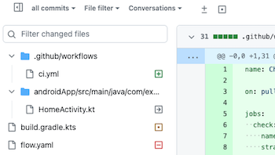
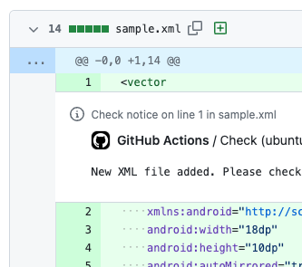

[](https://github.com/yumemi-inc/changed-files/actions/workflows/ci.yml)

# Changed Files

A GitHub Action that outputs a list of changed files in a pull request.
This output can be filtered, which is useful if you want to do something if a particular file is included in a pull request.

[Path filters](https://docs.github.com/en/actions/using-workflows/workflow-syntax-for-github-actions#onpushpull_requestpull_request_targetpathspaths-ignore) can also be used in workflow triggers, but using this action allows detailed control with steps.

## Usage

See [action.yml](action.yml) for available action inputs and outputs.
Note that this action requires `pull-requests: read` permission.

### Use a list of files

Use list of file names from `files` output.

```yaml
- uses: yumemi-inc/changed-files@v1
  id: changed
- run: |
    for file in ${{ steps.changed.outputs.files }}; do
      # do somethihg..
      echo "$file"
    done
```

> **Note:**
> This action only gets a list of file names.
> If you need access to a file, use [actions/checkout](https://github.com/actions/checkout) to check out the files.

By default, they are separated by spaces, but if you want to change the separator, specify it with `separator` input.

```yaml
- uses: yumemi-inc/changed-files@v1
  id: changed
  with:
    separator: ','
```

If you want to output in JSON instead of plain text like above, specify it with `format` input ( default is `plain` ).

```yaml
- uses: yumemi-inc/changed-files@v1
  id: changed
  with:
    format: 'json'
```

### filter files

The list of files can be filtered by specifying `patterns` input.

```yaml
- uses: yumemi-inc/changed-files@v1
  id: changed
  with:
    patterns: |
      **/*.{yml,yaml}
      !doc/**
```

To filter by file status, specify `statuses` input.

```yaml
- uses: yumemi-inc/changed-files@v1
  id: changed
  with:
    patterns: |
      **/*.{yml,yaml}
      !doc/**
    statuses: 'added'
```

<details>
<summary>about file status</summary>

There are four statuses for changed files in a pull request: `added`, `modified`, `renamed`, and `removed`.
File statuses are displayed as an icon in pull requests:



Note that renamed files will have `renamed` status even if edited.
</details>

To specify multiple statuses, separate them with non-alphabetic characters, such as a space, `,`, and `|`.

```yaml
statuses: 'added|modified|renamed'
```

Alternatively, you can specify the status to exclude with `exclude-statuses` input.

```yaml
exclude-statuses: 'removed'
```

### Whether a particular file is included in a pull request

Often we are only interested in whether a particular file is included in a pull request, not the list of files.
You can check it like `steps.<id>.outputs.files != null` ( for JSON, `'[]'` instead of `null` ), but you can also use `exists` output.

```yaml
- uses: yumemi-inc/changed-files@v1
  id: changed
  with:
    patterns: '!**/*.md'
- if: steps.changed.outputs.exists == 'true'
  run: # do something..
```

This is useful for controlling step execution.

<details>
<summary>examples</summary>

### Used as test execution condition

```yaml
- uses: actions/checkout@v4
- uses: yumemi-inc/changed-files@v1
  id: changed
  with:
    patterns: '**/*.js'
- if: steps.changed.outputs.exists == 'true'
  run: npm run test
```

#### Add a label to a pull request:

```yaml
- uses: yumemi-inc/changed-files@v1
  id: changed
  with:
    patterns: |
      **/*.js
      !server/**
- env:
    GH_REPO: ${{ github.repository }}
    GH_TOKEN: ${{ github.token }}
  run: |
    gh pr edit ${{ github.event.number }} ${{ steps.changed.outputs.exists == 'true' && '--add-label' || '--remove-label' }} 'frontend'
```

#### Annotate new files in a pull request using workflow commands:

```yaml
- uses: yumemi-inc/changed-files@v1
  id: changed
  with:
    patterns: '**/*.xml'
    statuses: 'added'
- if: steps.changed.outputs.exists == 'true'
  run: |
    for file in ${{ steps.changed.outputs.files }}; do
      echo "::notice file=$file::New XML file added. Please check .."
    done
```



For more information on workflow commands, see [Workflow commands for GitHub Actions](https://docs.github.com/en/enterprise-cloud@latest/actions/using-workflows/workflow-commands-for-github-actions).

#### Warn with a comment on a pull request:

```yaml
- uses: yumemi-inc/changed-files@v1
  id: changed-src
  with:
    patterns: |
      **/*.{js,ts}
      package.json
- uses: yumemi-inc/changed-files@v1
  id: changed-build
  with:
    patterns: 'dist/**'
- if: steps.changed-src.outputs.exists == 'true' && steps.changed-build.outputs.exists != 'true'
  uses: yumemi-inc/comment-pull-request@v1
  with:
    comment: ':warning: Please check if you forgot to build.'
```

#### Make the job fail:

```yaml
- uses: yumemi-inc/changed-files@v1
  id: changed
  with:
    patterns: 'CHANGELOG.md'
    exclude-statuses: 'removed'
- if: steps.changed.outputs.exists != 'true' && github.base_ref == 'main'
  run: |
    echo "::error::CHANGELOG.md is not updated."
    exit 1
```
</details>

If you just want to run a Bash script, you can use `run-if-exists` input.
In this case, you can omit assigning a job id (`id: changed` in the above example) for the subsequent step, but note that output such as a list of files cannot be used here.

```yaml
- uses: yumemi-inc/changed-files@v1
  with:
    patterns: '!**/*.md'
    run-if-exists: # do something..
```

### Use number of changed lines

`changes` output is the total number of changed lines.
This can be used in comparison expressions.

```yaml
- uses: yumemi-inc/changed-files@v1
  id: changed
  with:
    patterns: '!doc/**'
    exclude-statuses: 'removed'
- if: 100 < steps.changed.outputs.changes
  run: # do something..
```

`additions` output and `deletions` output can also be used in the same way ( `additions + deletions = changes` ).

<details>
<summary>examples</summary>

#### Add a label to a pull request:

```yaml
- uses: yumemi-inc/changed-files@v1
  id: changed
  with:
    patterns: '!doc/**'
    exclude-statuses: 'removed'
- env:
    GH_REPO: ${{ github.repository }}
    GH_TOKEN: ${{ github.token }}
  run: |
    gh pr edit ${{ github.event.number }} ${{ 100 < steps.changed.outputs.changes && '--add-label' || '--remove-label' }} 'large PR'
```

#### Warn with a comment on a pull request:

```yaml
- uses: yumemi-inc/changed-files@v1
  id: changed
  with:
    patterns: '!doc/**'
    exclude-statuses: 'removed'
- if: 100 < steps.changed.outputs.changes
  uses: yumemi-inc/comment-pull-request@v1
  with:
    comment: ':warning: Changes have exceeded 100 lines.'
```
</details>

## Tips

### Process output list with JavaScript

Use JSON format output and [actions/github-script](https://github.com/actions/github-script).

```yaml
- uses: yumemi-inc/changed-files@v1
  id: changed
  with:
    format: 'json'
- uses: actions/github-script@v6
  env:
    FILES: ${{ steps.changed.outputs.files }}
  with:
    script: |
      const { FILES } = process.env;
      const files = JSON.parse(FILES);
      files.forEach(file => {
        // do something..
        console.log(file);
      });
```

### Comment to `patterns` input

Characters after `#` are treated as comments.
Therefore, you can write an explanation for the pattern as a comment.

```yaml
- uses: yumemi-inc/changed-files@v1
  id: changed
  with:
    patterns: |
      # sorces
      **/*.{js,css,png}
      !dist/** # exclude built files

      # documents
      doc/**
      !doc/**/*.png # exclude image files
```

### Control job execution

Set to job output, reference in subsequent jobs.

```yaml
outputs:
  exists: ${{ steps.changed.outputs.exists }}
steps:
  - uses: yumemi-inc/changed-files@v1
    id: changed
    with:
      patterns: '**/*.{kt,kts}'
```


<details>
<summary>examples</summary>

#### Run two jobs in parallel, then run a common job:

```yaml
jobs:
  changed:
    runs-on: ubuntu-latest
    permissions:
      pull-requests: read
    outputs:
      exists-src: ${{ steps.changed-src.outputs.exists }}
      exists-doc: ${{ steps.changed-doc.outputs.exists }}
    steps:
      - uses: yumemi-inc/changed-files@v1
        id: changed-src
        with:
          patterns: 'src/**'
      - uses: yumemi-inc/changed-files@v1
        id: changed-doc
        with:
          patterns: 'doc/**'
  job-src:
    needs: [changed]
    if: needs.changed.outputs.exists-src == 'true'
    runs-on: ubuntu-latest
    steps:
      ...
  job-doc:
    needs: [changed]
    if: needs.changed.outputs.exists-doc == 'true'
    runs-on: ubuntu-latest
    steps:
      ...
  job-common:
    needs: [job-src, job-doc]
    # treat skipped jobs as successful
    if: cancelled() != true && contains(needs.*.result, 'failure') == false
    runs-on: ubuntu-latest
    steps:
      ...
```
</details>

## About the glob expression of `pattern` input

Basically, it complies with the [minimatch](https://www.npmjs.com/package/minimatch) library used in this action.
Please refer to the implementation in [action.yml](action.yml) for the specified options.
